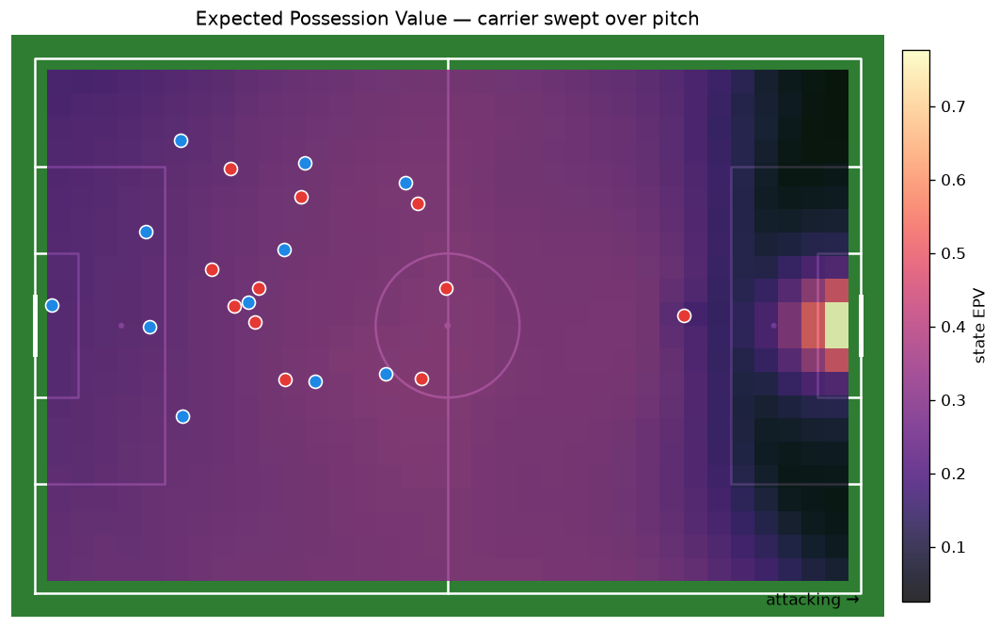
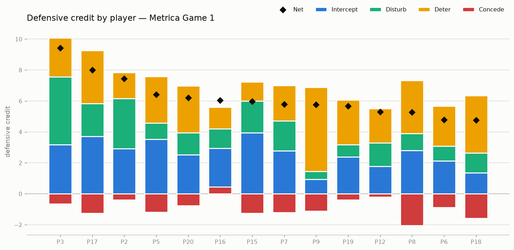
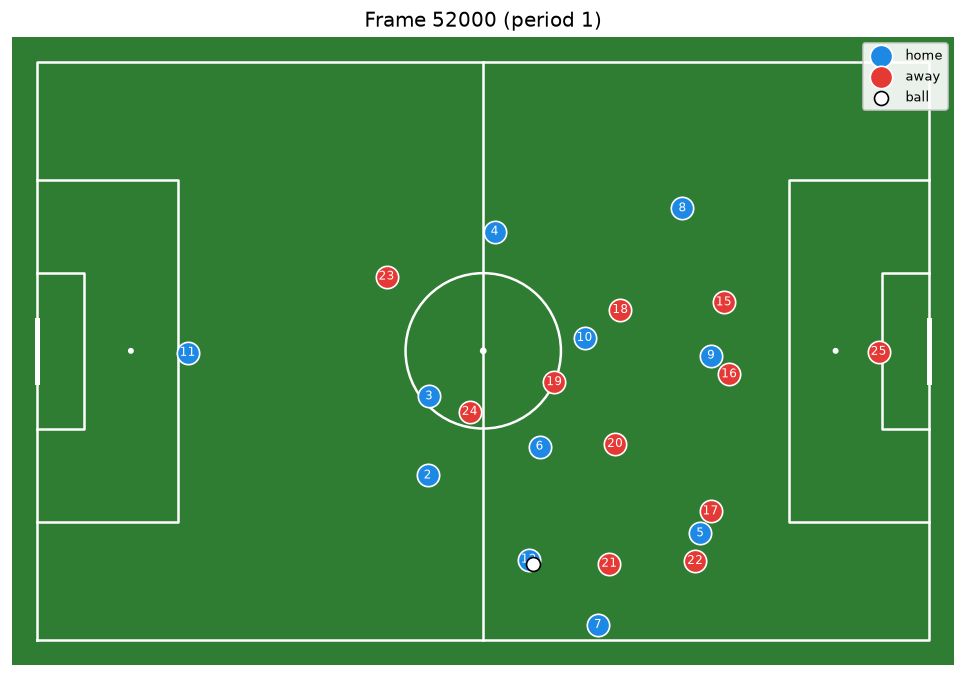
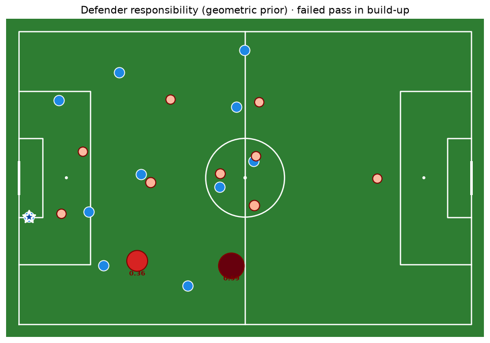
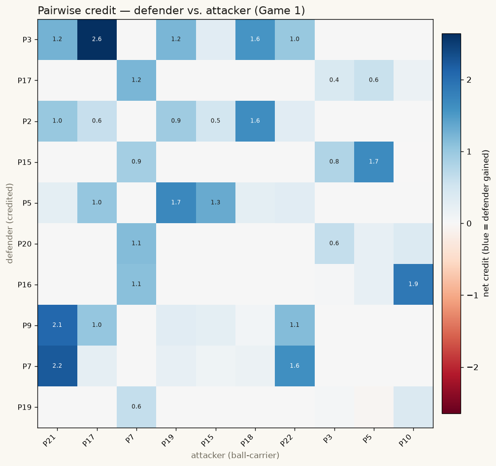
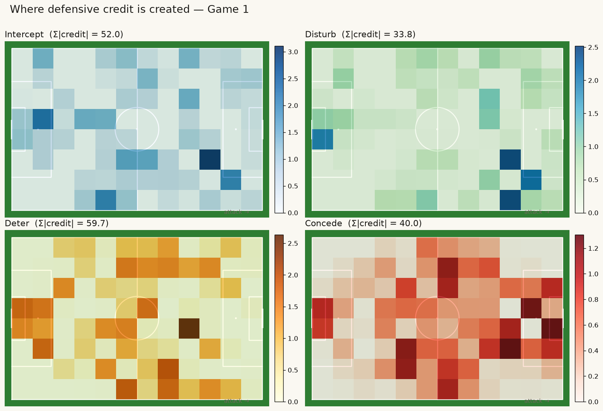
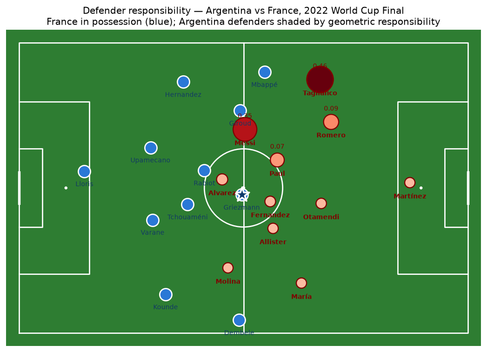
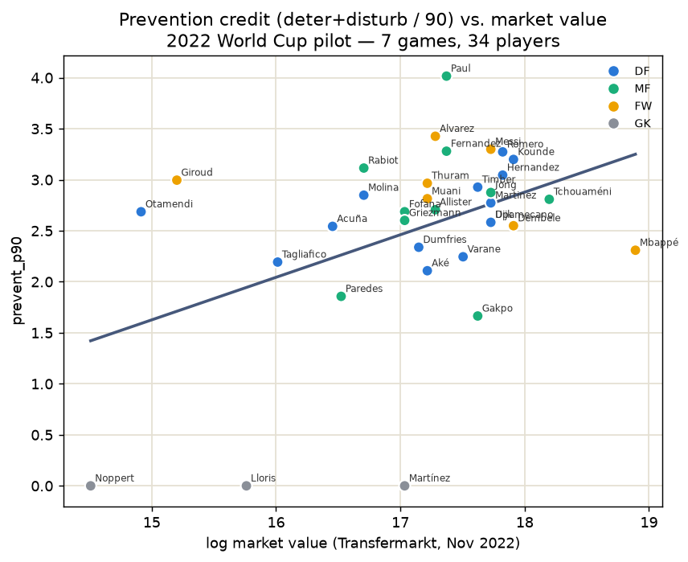

# DEFCON — Reproducing "Better Prevent than Tackle"

An independent, from-scratch, **test-driven reproduction** of:

> **Better Prevent than Tackle: Valuing Defense in Soccer Based on Graph Neural Networks**
> Hyunsung Kim, Sangwoo Seo, Hoyoung Choi, Tom Boomstra, Jinsung Yoon, and Chanyoung Park
> (KAIST · Fitogether Inc. · AFC Ajax)

> [!IMPORTANT]
> **Unofficial, personal project.** Not the authors' code; not affiliated with or endorsed by the
> authors, KAIST, Fitogether, or AFC Ajax. Reproduces the method for educational / portfolio
> purposes. All credit for the ideas and framework belongs to the original authors
> ([Credits](#credits)). Any bugs or deviations are mine.

DEFCON quantifies how much *individual defenders* contribute — not only through visible actions
(tackles, interceptions) but through **positioning that prevents danger before it happens**. The
core idea: defense is the zero-sum mirror of offense. Every attacking action changes the attacking
team's **Expected Possession Value (EPV)**; the negation of that change is the defending team's
value, which DEFCON distributes onto individual defenders with scenario-specific credit rules.

**📊 Live results dashboard:** [reproduction benchmark →](https://claude.ai/code/artifact/bea62962-6d6b-4bc2-b3c6-392539acf9c7)

---

## Status

Milestones **M1–M5 complete, M6 partial**; **108 passing tests**; the full pipeline runs
end-to-end on public data. What works, and what's honestly limited:

| Phase | State | |
|---|---|---|
| 0 Setup · 1 Data pipeline · 2 Features | ✅ | loaders, sync, kinematics, labels, 25-dim player graphs |
| 3 Component models | ✅ (6/7) | 6 GNNs + UxG; shot-blocking (b2) deferred |
| 4 EPV computation | ✅ | per-option + state EPV |
| 5 Credit assignment | ✅ | 7 rules; **paper's Fig-3 & Fig-5 worked examples reproduced exactly** |
| 6 Aggregation | ✅ | per-90, Figure-6, season roll-up |
| 7 Evaluation | ✅ 4/4 | Table 3, backbone + boosting baselines, rankings ✅ · **market-value study reproduced (directionally) on a 7-game PFF World Cup pilot** ✅ |
| 8 Apps · 9 Packaging | ○ | in progress |

---

## Headline results

**Component models** (held-out; GNNs train on Metrica Game 1, validate on Game 2; UxG on 45,945
external Wyscout shots). Paper numbers come from **564 private matches**, so this is a small-data
reproduction:

| Model | Metric | Ours | Paper | Notes |
|---|---|---|---|---|
| c3 · UxG | AUC | **0.785** | 0.75–0.80 | ✅ recovers the paper's exact 45,945-shot count |
| b1 · pass-success | AUC / Brier | **0.823 / 0.087** | 0.917 / 0.093 | ✅ well-calibrated |
| a1 · action-selection | MRR | **0.670** | 0.800 | ✅ beats nearest-teammate baseline (0.535) |
| c1 · goal-scoring | AUC | **0.749** | ~0.68 | ✅ real ranking signal |
| c2 · goal-conceding | AUC | — | ~0.62 | ⚠️ 0 positive training examples in 1 match |
| d1 · responsibility | MRR | 0.272 | 0.694 | ⚠️ only 146 failed-pass examples |
| EPV | corr(→goal) | **+0.91** | — | ✅ EPV rises toward the opponent goal |

### Two honest findings I did not massage toward the paper

1. **On 2 matches, GAT does *not* win.** Swapping the backbone, GCN beats GAT on pass-success
   (AUC **0.880** vs 0.823) and action-selection (MRR **0.694** vs 0.670), and gradient boosting is
   competitive (XGBoost 0.869). GIN collapses. The paper's attention advantage appears to need far
   more data than two public matches provide.
2. **The headline "better prevent than tackle" pattern reproduces — directionally — on a 7-game World
   Cup pilot.** The paper's signature result needs real player identities (to join credit → market
   value), which the anonymized Metrica sample can't provide. So I built a second, real-identity path:
   a loader for **PFF FC's 2022 World Cup** tracking + events (`defcon.data.pff`, `defcon.data.pff_events`),
   ran the full credit pipeline over **7 knockout games (34 players)**, and joined **Transfermarkt** market
   values (Nov 2022). The finding, for **defenders**: raw **Intercept credit barely tracks value
   (r = +0.02)** while **prevention (Disturb) tracks it strongly (r = +0.51)** — expensive defenders
   aren't the biggest ball-winners, they're the best *positioners*. That is the paper's core claim.
   Honest caveats: the EPV models are Metrica-trained (a cross-provider **domain shift**, so credit
   *magnitudes* are approximate), n = 34 over 7 games (not the paper's 564), so this is **directional,
   not statistically conclusive** — and the *Concede-negative* half of the paper's specific claim does
   **not** cleanly reproduce at this sample size. See the scatter below and `scripts/process_pff.py`.

---

## Figures (generated by the running pipeline)

| | |
|---|---|
|  |  |
| **Expected Possession Value** as the ball-carrier is swept over the pitch — peaks in front of goal. | **Defensive credit** per player: Intercept / Disturb / Deter (up) and Concede (down), with Net (paper's Fig 6). |
|  |  |
| A parsed **11 v 11 tracking frame** — raw CSV → unified schema, ball at feet, keepers at opposite ends. | **Defender responsibility** for a failed pass — mass concentrates on the nearest defenders. |
|  |  |
| **Pairwise credit** — net credit each defender earned against each attacker (who neutralizes whom). | **Credit by zone** — where each category is created; Concede clusters in the attacking third. |

**On real, named players** — the framework applied to a live frame of the **2022 World Cup Final**
(PFF tracking), France building through Griezmann with Mbappé as the pass option; Argentina's defensive
responsibility falls on Tagliafico and a tracking-back Messi. Model-free geometric prior on real
tracking (not the Metrica-trained GNN — that would be a domain-shift overclaim):



**The headline study, reproduced on a WC pilot** — prevention credit (Deter+Disturb per 90) vs.
Transfermarkt market value across 7 knockout games (34 players, colored by position). Defenders trend
up (better positioners are more valuable); forwards like Mbappé sit low (prevention isn't their job).



**Interactive:** [cumulative credit timeline](https://claude.ai/code/artifact/e8cc5f61-4b51-4877-bbc2-5d1e7c33cfae) · [full results dashboard](https://claude.ai/code/artifact/bea62962-6d6b-4bc2-b3c6-392539acf9c7)

---

## Method

For each on-ball action `k`:

1. **EPV** via a learned decomposition — action selection × success probability ×
   outcome-conditioned value (Eqs 1–2, 16–17; following Fernández et al.).
2. **Team defensive value** `D(s_k) = EPV(s_k) − EPV(s_{k+1})` (Eqs 3–4).
3. **Defender responsibility** — `P(defender v recovers the ball | action fails)` (Eq 5).
4. **Credit assignment** — the rule matching the scenario (intercepted / conceded / deterred /
   foul / blocked shot / unblocked shot) splits `D` onto players (Eqs 6–15).
5. **Aggregate** per player into **Intercept / Disturb / Deter / Concede**, per 90 minutes.

### Component models

| Model | Task | Type |
|---|---|---|
| Action selection (a1) | Which option the carrier attempts | GAT · softmax over teammates + goal |
| Pass success (b1) | P(pass completes) | GAT · node-wise |
| Shot blocking (b2) | P(shot blocked) | GAT · graph-level *(deferred)* |
| Goal-scoring (c1) | Outcome-conditioned P(score soon) | GAT · node-wise, 2 logits |
| Goal-conceding (c2) | Outcome-conditioned P(concede soon) | GAT · node-wise, 2 logits |
| UxG (c3) | Expected goal, unblocked shot | Logistic regression |
| Responsibility (d1) | Which defender wins a failed action | GAT · softmax over opponents, 26-feat |

---

## Data

The paper uses **proprietary** AFC Ajax tracking (564 Eredivisie matches). That is private and never
included here. Public substitutes (all git-ignored, none redistributed):

| Purpose | Source |
|---|---|
| Tracking + events (build/test) | [Metrica Sports sample](https://github.com/metrica-sports/sample-data) (Games 1 & 2; anonymized) |
| Tracking + **real identities** | [PFF FC 2022 World Cup](https://www.blog.fc.pff.com/blog/enhanced-2022-world-cup-dataset) (free, request-gated; loader in `defcon.data.pff`) |
| Unblocked-shot xG | [Wyscout open events](https://figshare.com/collections/Soccer_match_event_dataset/4415000) (Pappalardo et al., 2019) |
| Market values | [Transfermarkt](https://www.transfermarkt.com) — joinable once PFF real identities are in |

---

## Quickstart

```bash
# 1. Environment (Python 3.11 recommended for torch-geometric)
python3.11 -m venv .venv && source .venv/bin/activate
pip install -e ".[dev,gnn,boost,viz]"

# 2. Data (git-ignored)
python scripts/download_wyscout.py          # Wyscout shots -> data/raw/wyscout/
python scripts/download_metrica.py           # Metrica Games 1 & 2 -> data/raw/tracking/metrica/
python scripts/download_pff.py --sample      # real PFF World Cup Final sample (real player names)
python scripts/pff_demo.py                    # -> docs/img/pff_wc_final_responsibility.png

# 3. Train the component models
python scripts/train_uxg.py                  # UxG (logistic regression)
python scripts/train_pass_success.py         # b1 pass-success GAT
python scripts/train_components.py           # a1, c1, c2, d1

# 4. EPV, credit, aggregation
python scripts/compute_epv.py                # EPV surface + monotonicity check
python scripts/compute_credits.py --game 1   # per-action defensive credit
python scripts/aggregate_credits.py          # per-90 + Figure-6 + season roll-up

# 5. Evaluation
python scripts/run_baselines.py              # GAT vs GCN/GIN/XGBoost/CatBoost
python scripts/make_tables.py                # Table 3 + ranking Tables 5-7

# Tests
pytest
```

---

## Repository layout

```
src/defcon/
  config.py     # YAML-backed typed config
  data/         # wyscout, metrica, pff loaders · sync · kinematics · labels · receiver · cache · pipeline
  features/     # geometry · state · nodes (25-dim) · graph (edges/PyG/26th feat) · dataset
  models/       # gat (GAT/GCN/GIN backbones + heads) · uxg · train (3 training modes)
  epv/          # EPVEngine — per-option + state EPV
  credit/       # rules (Eqs 6-15) · engine (team value, router, aggregate) · aggregate (per-90)
  eval/         # baselines · tables · market_value
  viz/          # pitch · credit (Figure-6)
scripts/        # runnable entry points (download, train, compute, evaluate)
configs/        # default.yaml
tests/          # 108 tests (pytest); tests/data/pff = real PFF WC-Final sample
docs/           # SCOPE.md, figures
```

---

## Credits

**Original paper and method** — all core credit belongs to the authors:

> Kim, Seo, Choi, Boomstra, Yoon, Park. *Better Prevent than Tackle: Valuing Defense in Soccer
> Based on Graph Neural Networks.*

Builds on prior work cited in the paper: **EPV** (Fernández, Bornn & Cervone); **VAEP** (Decroos et
al.); **Graph Attention Networks** (Veličković et al.); **xT** (Karun Singh); the **Wyscout open
dataset** (Pappalardo et al., 2019); **Transfermarkt** market values. Please cite the original paper,
not this repository.

## License & disclaimer

Personal educational/portfolio project. Reimplements a published method but contains no code or data
from the original authors, and is not affiliated with them or their institutions. No proprietary
data is included or redistributed.
